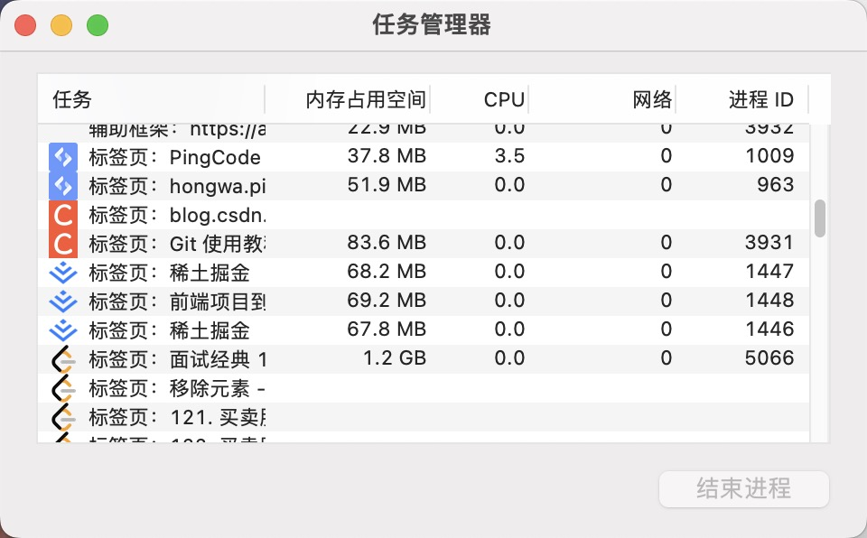

# 进程与线程

## 进程

程序运行的载体，是系统进行资源（CPU、内存、磁盘等）分配和调度的基本单位。理解：程序运行时在内存中开辟一块内存空间。

## 线程

CPU调度和执行的单位，是进程的一个执行单位。理解：执行程序的人

## 进程与线程的关系

- 一个进程可以包含多个线程，一个进程开启后必须有一个线程，这个线程称为主线程。

## 进程与线程的区别

## 浏览器中的进程与线程

- 在浏览器中，每个标签页通常都是一个独立的进程，隔离不同页面的运行环境。
原因：假如某个标签页中运行了一个耗时的任务或者卡死，不会影响其他标签页的运行。

- 证据
  谷歌浏览器：右键

### 浏览器的进程包括：

- 主进程：浏览器的主进程，负责页面渲染、用户交互、子进程管理等。
- 渲染进程：负责页面的渲染，每个标签页一个渲染进程。
- 插件进程：负责插件的运行，每个插件一个插件进程。
- GPU进程：负责GPU的加速，一个GPU进程对应一个GPU。
- 网络进程：负责网络请求，一个网络进程对应一个域名。
- 存储进程：负责本地存储，一个存储进程对应一个域名。
- 媒体进程：负责音频、视频的播放，一个媒体进程对应一个标签页。
- 沙箱进程：负责沙箱安全隔离，一个沙箱进程对应一个标签页。
- 子进程：负责子进程的运行，一个子进程对应一个标签页。

### 浏览器中的多线程

每个页签看作是浏览器内核的一个进程，该进程是多线程的，包括以下几类子线程

- GUI渲染线程：负责渲染页面，解析HTML、CSS，构建DOM树和Render树，布局和绘制页面。
- JS引擎线程：负责解析和执行JavaScript代码，包括V8引擎。
- 事件触发线程：负责将准备好的事件交给JS引擎线程。
- 定时触发器线程：负责定时器的触发。
- 异步HTTP请求线程：负责发起网络请求，并在请求完成后将结果交给JS引擎线程。
- 