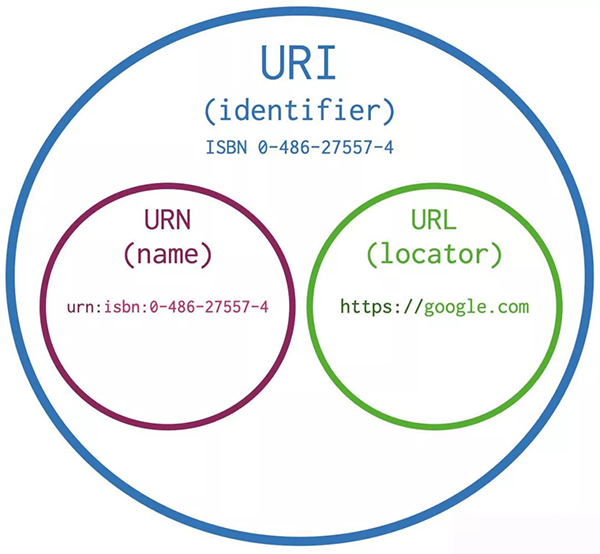

# 定义

URI（Uniform Resource Identifier）统一资源标识符
URL（Uniform Resource Locator）统一资源定位符
URN(Uniform Resource Name)统一资源名称

URI是URL和URN的父类，它是一种抽象的定义，只规定了URI的构成元素，并没有规定如何解析。
URN的定义比较早，而URL的定义比较晚，所以现在大部分的URI都已经是URL了。

# URL

作用：资源在Web上的地址，可以是一个HTML页面，一个CSS文档，一幅图片或者是一个瞄片等。

- http协议访问web服务器

- ftp协议上传和下载文件

- 读取客户端计算机本地文件


## 查找协议说明文档

```
https://www.rfc-editor.org/
```
